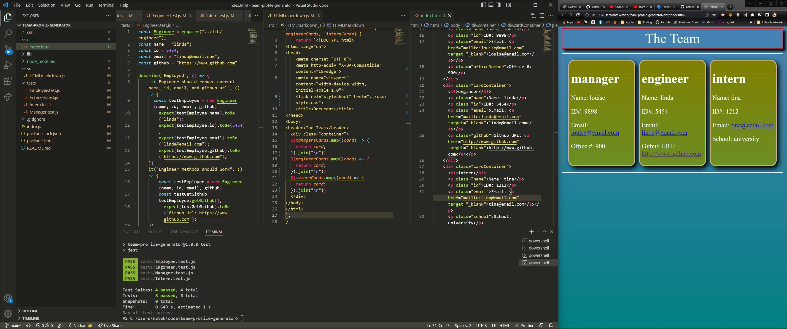

# Team Profile Generator

### Table of contents

- [Description](#description)
- [Installation](#installation)
- [Usage](#usage)

- [Contributing](#contributing)
- [Tests](#tests)
- [Questions](#questions)

## Description

using object oriented programming and node.js and javascript to generate an html page based on the users input to generate a company team profile generator

## Installation

to install please run this command
'node index.js' for app and 'npm test' to run tests

## Usage

for creating a team profile in html

## Contributing

N/A

## Tests

npm test

## Questions

https://www.github.com/batemanz

## Links

[Link to video](https://youtu.be/R80fdWqZ4Bo)

[GitHub Repository](https://github.com/batemanz/team-profile-generator.git)

## Screenshots

